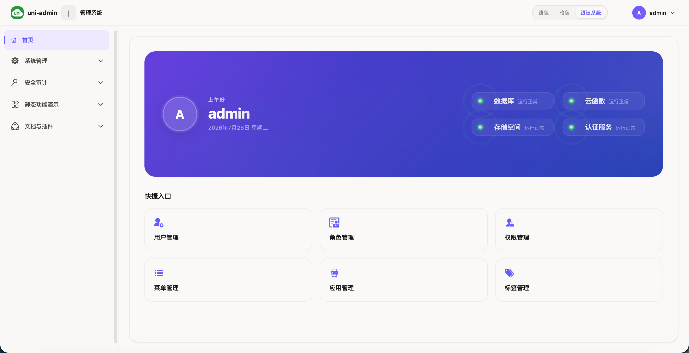
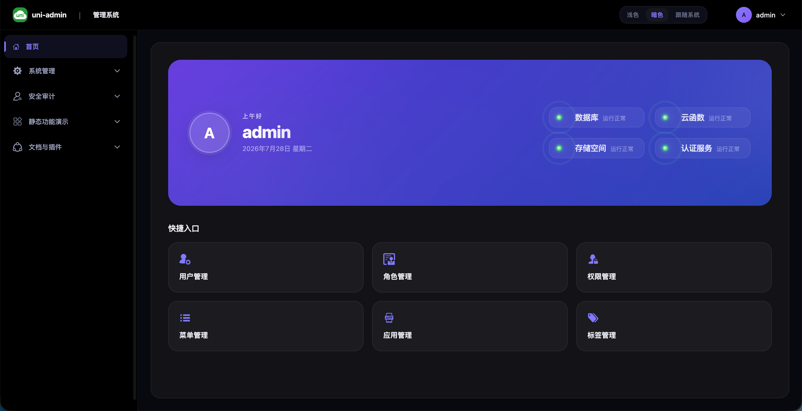
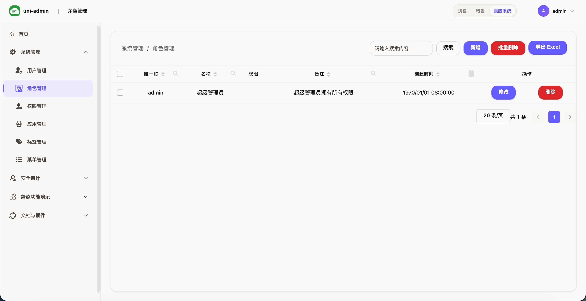
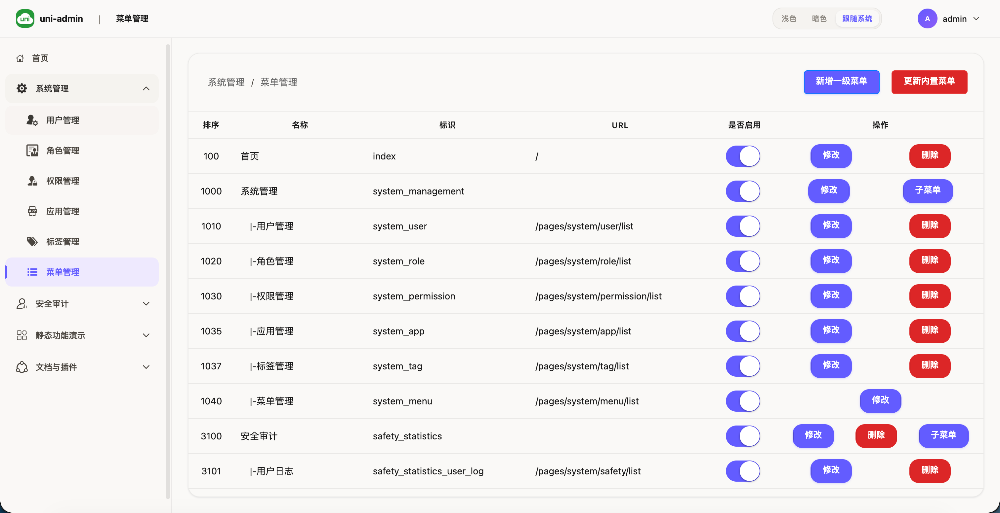

# uni-admin Modern UI

基于 DCloud 官方 uni-admin 二次开发的现代化管理后台模板。暖白浅色 + 毛玻璃暗色双主题，CSS Variables 驱动，开箱即用。

## 预览






---

## 快速开始

### 第一步：关联云服务空间

> 本项目依赖 uniCloud 云数据库和云函数，必须先关联云服务空间。

1. 在 HBuilderX 中打开本项目
2. 右键项目根目录 → **关联云服务空间**
3. 选择已有的 uniCloud 空间，或点击「新建」创建一个（支持阿里云或腾讯云）

### 第二步：上传部署数据库

1. 展开 `uniCloud-alipay/database/`
2. 右键 `database` 目录 → **上传 DB schema**
3. 在弹出的确认窗口中点「上传」，等待完成
4. 打开 uniCloud 控制台 → 数据库，确认所有数据表已创建

> 数据库 schema 定义了表结构和字段约束，上传后才会在云空间中创建对应的表。

### 第三步：上传部署云函数

1. 展开 `uniCloud-alipay/cloudfunctions/`
2. 右键 `cloudfunctions` 目录 → **上传所有云函数**
3. 也可以逐个右键上传（`common` 模块需先上传）
4. 上传后建议在 uniCloud 控制台对每个云函数点击「测试运行」验证无报错

### 第四步：本地启动开发预览

1. 在 HBuilderX 顶部工具栏选择运行目标（浏览器 / 小程序模拟器）
2. 点击 **运行 → 运行到浏览器** 或直接按快捷键
3. 首次启动会安装依赖，稍等片刻
4. 默认管理员账号密码登录（uni-id-pages 提供登录页）

> ⚠️ 如果遇到云函数调用报错，检查关联的服务空间是否正确，云函数是否已全部上传。

---

## 项目结构

```
├── App.vue                       # 应用入口（全局生命周期、主题初始化）
├── main.js                       # Vue 实例挂载、插件注册
├── uni.scss                      # 全局 SCSS 变量 + 主题 Token 映射
├── admin.config.js               # 中心配置文件（站点信息、菜单、主题选项）
├── pages.json                    # 路由注册 + 窗口布局配置
├── vite.config.js                # Vite 构建配置
├── index.html                    # H5 入口 HTML
├── template.h5.html              # H5 模板 HTML
│
├── styles/design-system/         # 设计系统
│   ├── _tokens.scss              # 主题无关 Token（间距、圆角、阴影、字体）
│   ├── _themes.scss              # 浅色/暗色 CSS Variables 完整映射
│   ├── _base.scss                # 全局 reset + 滚动条 + 毛玻璃
│   └── index.scss                # 入口文件
│
├── common/                       # 全局样式
│   ├── uni.css                   # 布局与组件样式覆盖
│   ├── theme.scss                # uni-ui 主题兼容层
│   ├── uni-icons.css             # 图标字体
│   └── admin-icons.css           # 管理后台图标
│
├── components/                   # 通用组件
│   ├── app-card/                 # 通用卡片容器
│   ├── app-stat-card/            # 统计数字卡片
│   ├── app-empty/                # 空状态展示
│   ├── app-skeleton/             # 骨架屏
│   ├── app-toast/                # 轻提示
│   ├── app-badge/                # 状态徽章
│   ├── uni-nav-menu/             # 侧栏导航菜单
│   ├── uni-stat-breadcrumb/      # 面包屑
│   ├── uni-stat-panel/           # 统计面板
│   ├── uni-stat-table/           # 统计表格
│   ├── uni-stat-tabs/            # 统计标签页
│   └── ...                       # 其他内置组件
│
├── windows/                      # 布局窗口
│   ├── topWindow.vue             # 顶部导航栏（Logo、主题切换、用户信息）
│   └── leftWindow.vue            # 左侧菜单栏
│
├── pages/                        # 页面
│   ├── index/                    # Dashboard 首页
│   ├── system/                   # 系统管理（用户/角色/权限/菜单/应用/日志）
│   ├── uni-stat/                 # 数据统计分析
│   └── demo/                     # 功能演示
│
├── store/                        # Vuex 状态管理
│   ├── index.js                  # 入口
│   ├── constants.js              # 常量
│   └── modules/                  # 子模块
│
├── i18n/                         # 国际化
│   ├── zh-Hans.json              # 简体中文
│   ├── zh-Hant.json              # 繁体中文
│   ├── en.json                   # 英文
│   └── index.js                  # 入口
│
├── js_sdk/                       # SDK 模块
│   ├── uni-admin/                # admin 核心 SDK
│   ├── uni-id-pages/             # 用户认证 SDK
│   ├── uni-stat/                 # 统计 SDK
│   ├── validator/                # 数据校验
│   └── ext-storage/              # 扩展存储
│
├── uniCloud-alipay/              # uniCloud 云资源
│   ├── database/                 # 数据库 Schema（数据表定义）
│   ├── cloudfunctions/           # 云函数 + 云对象
│   │   ├── common/               # 公共模块
│   │   └── ...                   # 业务云函数
│   └── README.md                 # 云开发说明
│
├── static/                       # 静态资源
├── mock/                         # 本地 Mock 数据
├── docs/                         # 开发文档
├── AGENTS.md                     # AI 开发指南
└── README.md                     # 本文件
```

---

## 新增页面

本项目的页面开发遵循 uni-app 标准路由 + uni-admin 菜单注册流程。

### 1. 创建页面文件

在 `pages/` 下新建目录和 vue 文件，例如新增一个「文章管理」页面：

```
pages/
└── article/
    ├── list.vue         # 文章列表
    └── add.vue          # 新增/编辑文章
```

### 2. 注册路由

打开 `pages.json`，在 `pages` 数组中添加路由：

```json
{
  "path": "pages/article/list",
  "style": {
    "navigationBarTitleText": "文章管理"
  }
},
{
  "path": "pages/article/add",
  "style": {
    "navigationBarTitleText": "新增文章"
  }
}
```

> 注意：uni-admin 多窗口布局下，页面路由不要设置 `topWindow` / `leftWindow`，这些在全局配置中已定义。

### 3. 注册菜单

打开 `admin.config.js`，在 `menu` 数组中添加菜单项：

```js
{
  "menu_id": "article",
  "name": "文章管理",
  "icon": "/static/icon/article.png",
  "url": "/pages/article/list",
  "sort": 100,
  "parent_id": ""  // 留空为顶级菜单，填写父级 menu_id 则作为子菜单
}
```

### 4. 配置权限（可选）

在 uni-admin 后台 → 权限管理中添加对应权限标识，然后在需要权限的页面或接口中使用：

```js
$hasPermission('article:list')    // 是否拥有权限
$hasRole('admin')                  // 是否拥有角色
```

> admin 角色默认拥有所有权限，免检。

### 页面开发规范

详细规范见 `docs/ai-agent-docs/page-dev.md`，包括：

- 列表页开发（searchbox + uni-table + uni-pagination 组合）
- 表单页开发（uni-forms + 校验）
- 数据列表的搜索、分页、筛选
- uni-stat 统计页面集成

---

## 新增云函数

云函数运行在 uniCloud 服务端，用于处理数据库操作、业务逻辑等。

### 1. 新建云函数

在 `uniCloud-alipay/cloudfunctions/` 目录下：

- **方式一（推荐）：** 右键 → **新建云函数**，输入名称，HBuilderX 自动生成模板
- **方式二：** 手动创建文件夹 + `index.js`，参考已有云函数的结构

基础结构：

```js
'use strict';
exports.main = async (event, context) => {
  const { action, data } = event;
  
  switch (action) {
    case 'list':
      // 查询列表
      break;
    case 'add':
      // 新增
      break;
    default:
      return { code: 400, message: '未知操作' };
  }
};
```

### 2. 上传部署

右键云函数目录 → **上传部署**。每次修改后都需要重新上传。

### 3. 前端调用

```js
uniCloud.callFunction({
  name: '云函数名',
  data: { action: 'list', data: { page: 1 } }
}).then(res => {
  console.log(res.result);
});
```

---

## 新增云对象

云对象是云函数的升级版，支持面向对象的方式定义方法，推荐用于业务模块。

### 1. 新建云对象

在 `uniCloud-alipay/cloudfunctions/` 下右键 → **新建云对象**，输入名称。

基础结构：

```js
module.exports = {
  async list(params) {
    // 查询列表
    const db = uniCloud.database();
    const res = await db.collection('article').get();
    return { code: 0, data: res.data };
  },
  
  async add(params) {
    // 新增
    const db = uniCloud.database();
    await db.collection('article').add(params);
    return { code: 0, message: '新增成功' };
  }
};
```

### 2. 上传部署

同云函数，右键 → **上传部署**。

### 3. 前端调用

```js
const articleObj = uniCloud.importObject('article');
const res = await articleObj.list({ page: 1 });
```

> 云对象比云函数更简洁：不需要 switch-case 分发 action，每个方法天然是一个接口。

### 云开发规范

详细规范见 `docs/ai-agent-docs/cloud-dev.md`，包括：

- 云函数/云对象开发流程
- 数据库操作（增删改查、聚合、联表）
- 权限校验（uni-id 集成）
- 错误处理与日志

---

## AI 辅助开发

本项目内置了完整的 AI 开发配置，适配 Cursor / Claude / Trae 等主流 AI 编码工具，让 AI 理解项目结构并正确生成代码。

### 核心配置文件

| 文件 | 作用 |
|---|---|
| `AGENTS.md` | 仓库总指南，告诉 AI 项目身份、技术栈禁忌、场景文档索引 |
| `docs/ai-agent-docs/page-dev.md` | 页面开发规范，AI 新增页面时读取 |
| `docs/ai-agent-docs/cloud-dev.md` | 云函数/云对象开发规范，AI 编写服务端代码时读取 |
| `docs/ai-agent-docs/style-dev.md` | 样式与主题规范，AI 修改样式时读取 |
| `docs/ai-agent-docs/admin-dev.md` | 系统管理功能规范（用户/角色/权限 CRUD） |
| `docs/ai-agent-docs/architecture.md` | 项目架构总览，AI 理解整体数据流时读取 |
| `docs/ai-agent-docs/references.md` | 官方文档链接索引 |

### AI 开发提示

在 AI 编码工具中打开本项目后，AI 会自动加载 `AGENTS.md` 了解项目约束。你需要告诉 AI 你要做什么：

**新增页面：**
```
我想在后台新增一个文章管理模块，包含列表页和新增表单页
```

**新增云对象：**
```
帮我创建一个 article 云对象，包含 list / add / update / delete 方法
```

**修改样式：**
```
把暗色模式的主背景颜色调深一点
```

AI 会根据场景读取对应的开发规范文档，生成符合项目约定的代码。

---

## 主题自定义

编辑 `styles/design-system/_themes.scss` 中的 CSS Variables：

```scss
// 浅色主题
[data-theme='default'] {
  --color-accent: #635bff;
  --color-bg-primary: #faf9f7;
  // ...
}

// 暗色主题
[data-theme='dark'] {
  --color-accent: #8178ff;
  --color-bg-primary: #08080f;
  // ...
}
```

修改后无需刷新页面，主题自动生效。支持 `data-theme="default"` / `"dark"` / `"auto"`（跟随系统）。

## 更新日志

见 [changelog.md](./changelog.md)

## 许可证

MIT License
